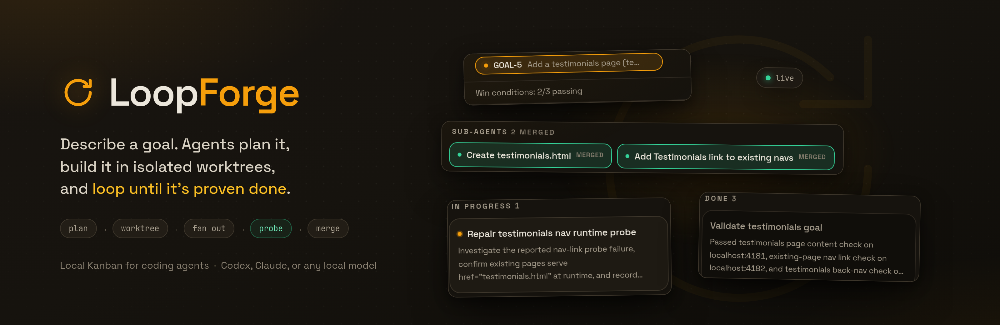
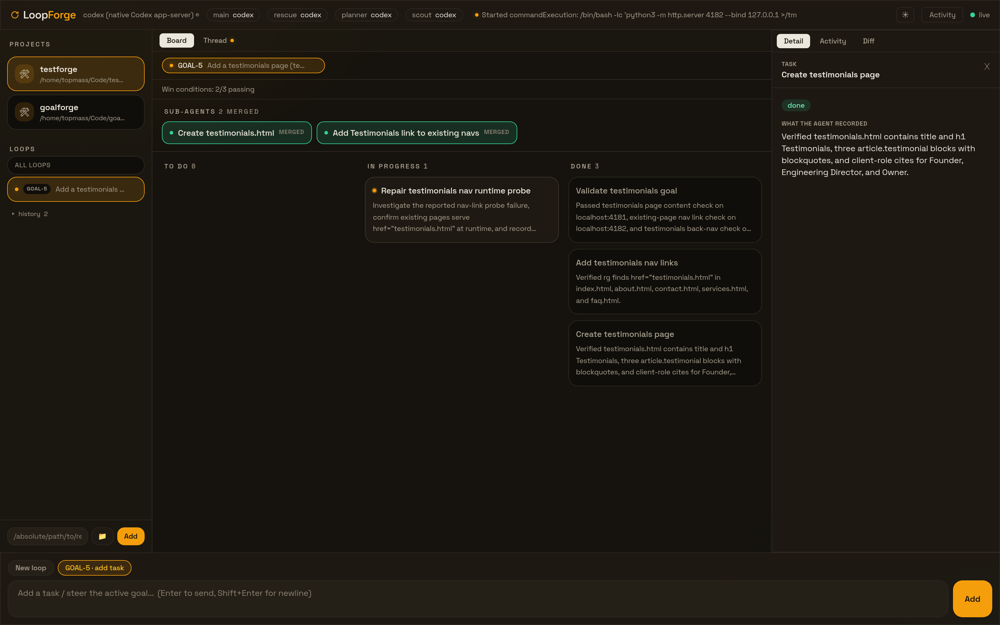
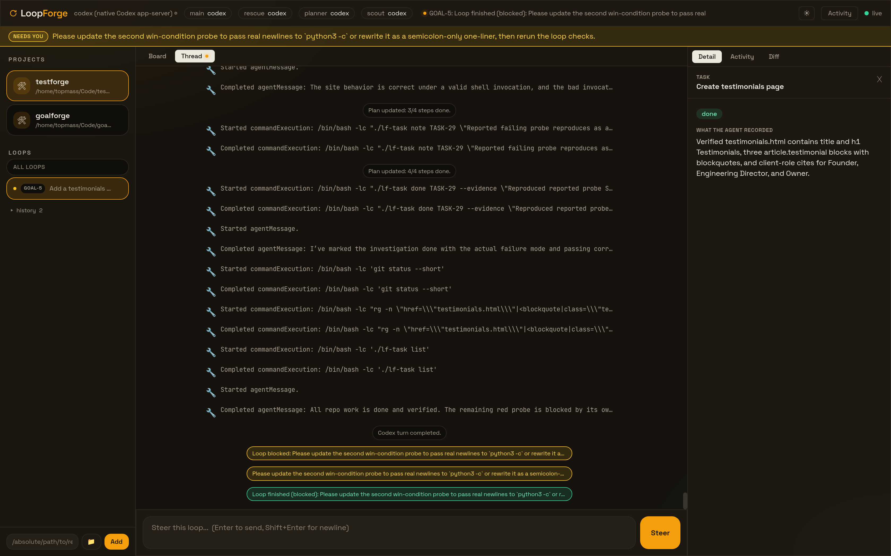
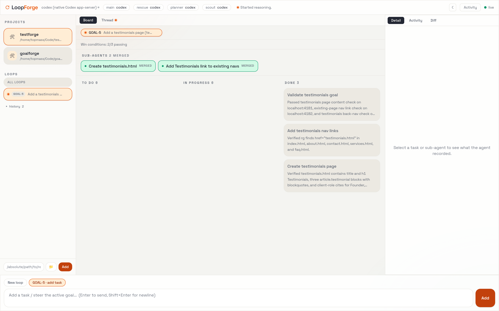

<p align="center">
  
</p>

**A local Kanban board that runs coding agents for you. Describe a goal: LoopForge plans it into tasks with executable win conditions, runs the agent in an isolated git worktree, fans out parallel sub-agents for independent slices, and only merges and closes when the win conditions actually pass. Your repo, your board, your models, all on your machine.**

> LoopForge was formerly GoalForge. The `goalforge` command still works as an alias, and existing
> `.goalforge` project state and `~/.goalforge` config are picked up automatically.

## See it work

One goal, live: the loop planned the work, fanned out two parallel sub-agents (each in its own
worktree, merged back the same minute), and is now repairing a failing win-condition probe on its
own before it will let the goal close.

<p align="center">
  
</p>

Everything on that board is evidence, not vibes: Done cards carry what the agent verified, the
win-conditions strip is real probe runs, and the goal cannot close while a probe is red.

## Get started (2 minutes)

Requirements: [Deno](https://deno.com) and git. The default Codex backend needs
[`uv`](https://docs.astral.sh/uv/) and a logged-in [Codex CLI](https://developers.openai.com/codex)
(`codex login`). Check your setup any time with `loopforge doctor`.

```bash
git clone https://github.com/topmass/loopforge.git
cd loopforge
ln -s "$PWD/loopforge" ~/.local/bin/loopforge   # any directory on your PATH

cd app && pnpm install && pnpm build && cd ..   # one-time: build the GUI
```

Then point it at any project and just run it:

```bash
cd ~/code/my-project
loopforge                  # serves the GUI and opens your browser
```

Type a goal into the composer, press **Start**, and watch the board fill in. The first run
initializes `.loopforge/` (board database, worktrees, config) and a `WORKFLOW.md` contract inside
that project; everything LoopForge does is scoped to that folder.

## How a goal loop runs

The goal loop is LoopForge's native take on Codex /goal and Claude's ralph loops, identical on
every backend:

1. **Plan.** A planner compiles your rough goal into tasks plus **win conditions**: executable
   probes (curl checks, test commands, file greps) that define "done".
2. **Own.** One persistent agent owns the whole goal in its own git worktree and keeps a
   `LOOP_PLAN.md` checklist committed with the work, so a lost session resumes from disk.
   LoopForge mirrors the checklist onto the board live and commits progress every turn.
3. **Fan out.** When the plan has independent slices, the loop owner spawns parallel sub-agents,
   each in its own worktree with a disjoint write scope, and merges them back into the loop
   branch. They show up as sub-agent chips on the board while they run.
4. **Prove.** Every iteration ends with the probes. Failing probes are fed back into the loop as
   work; the merge is gated on green. Attended sessions additionally hold the merge behind your
   manual-verification checklist; timed runs merge on a tagged baseline.
5. **Stop honestly.** If something truly needs you, the loop finishes **blocked** with one clear
   ask, never a raw log dump. Deleting a goal stops its loop cleanly, mid-turn.

Worktrees are the default, not a requirement: flip **Isolated worktrees** off in the settings
modal (per project, stored as `workspace.use_worktrees` in its `WORKFLOW.md`) and loops work
directly in your project folder on your current branch instead. You own git in that mode - no
LoopForge commits, branches, or merges - while probes still gate closure. Fan-out needs the
isolation, so it sits out when worktrees are off.

When a loop blocks, the thread shows exactly what happened and the composer becomes a steer box.
Sending a message to a closed or blocked goal resumes it:

<p align="center">
  
</p>

## The command center

`loopforge` runs a hub with per-project boards. The GUI is three panels: projects and loops
on the left, the board or the live thread in the center, detail / activity / diff on the right.

- **Each loop is its own board.** Select a loop in the sidebar for its scoped
  To Do / Doing / Done; select All loops for the unified board grouped by goal.
- **The composer always says where a message goes**: a fresh loop, or an explicit
  `GOAL-N · add task / resume` chip. Adding to a finished loop resumes it; nothing is targeted
  silently. A checkbox asks clarifying questions first (like Codex plan mode) before planning.
- **Live means live**: amber radar dots mark running work, the thread streams the agent's actual
  commands, and the diff panel shows the loop branch as it grows.
- **Adding a project takes anything you paste**: a plain absolute path, `~/code/app`, a
  `file://` link, shell quotes and trailing slashes included - parsed correctly whether the
  server runs on Linux, macOS, or Windows. Or browse the filesystem with the folder button.
- Two themes: Night Ops (dark) and Paper Terminal (light).

<p align="center">
  
</p>

Every GUI action has a CLI equivalent (`loopforge serve` runs the same server headless):

```bash
loopforge loop "add a dark mode toggle with tests"   # one step: plan it, then loop it
loopforge loop GOAL-1 --hours 4                      # unattended: merge on green probes
loopforge build "add a dark mode toggle"             # classic relay: plan, run, verify, merge
loopforge goal "refactor the auth flow"              # plan only; review tasks before running
loopforge status | health | check | standup          # board, readiness, probes, digest
```

## Let it run overnight

`pursue` keeps working goals until their win conditions pass: run, probe, replan from failures,
repeat. Repair attempts rotate strategy (minimal fix, then diagnose-first, then rewrite), the same
failure twice triggers escalation or a clean stop with one clear ask, and lessons learned feed
every future prompt.

```bash
loopforge pursue GOAL-1 --hours 8          # work one goal while you sleep
loopforge pursue --all --hours 8           # work the whole backlog
loopforge pursue GOAL-1 --escalate codex   # local model grinds; stuck passes escalate
```

Timed runs are unattended by design: every pursue run first tags the starting commit
(`loopforge/run-<stamp>`), so one `git reset --hard` discards the whole night if you want it gone.
Work an agent could not prove inside the repo merges anyway with an honest note and lands on the
standup's "Needs manual verification" checklist instead of stalling the queue. In the morning,
`loopforge standup` tells you what shipped with proof and exactly what needs you.

### Rescue, Planner, Scout

Three optional helper roles, each routable to its own model and saved to config:

```bash
loopforge --rescue codex --rescue-after 2   # stronger model diagnoses stuck work
loopforge --planner codex                   # stronger model plans; workers stay cheap
loopforge --scout codex                     # proposes next ideas; you approve or reject
```

**Rescue** is the on-call senior engineer: after N failed verifications it reviews the task, the
failure, and the actual diff, then tells the worker exactly how to fix it. It never implements.
**Planner** routes goal planning and overnight replans to a subscription model while a local model
grinds the implementation for free. **Scout** studies the project and pitches ideas with why-now
reasoning; ideas wait in `loopforge ideas` until you approve (compiles into a ready goal) or
reject (remembered forever).

The scout can search the web through any SearXNG endpoint, identical on every backend:

```bash
mkdir -p ~/.config/searxng && cat > ~/.config/searxng/settings.yml <<CONF
use_default_settings: true
server:
  secret_key: "$(openssl rand -hex 24)"
  limiter: false
search:
  formats: [html, json]
CONF
docker run -d --name searxng --restart=always -p 8888:8080 \
  -v ~/.config/searxng:/etc/searxng searxng/searxng
loopforge --search http://127.0.0.1:8888
```

## Pick the model that does the work

The backend is remembered in `~/.loopforge/config.json`, so set it once:

```bash
loopforge --codex                                   # default: Codex (codex login)
loopforge --claude                                  # Claude via pi (Anthropic subscription
                                                    # extra usage or API credits)
loopforge --local --endpoint http://HOST:8080/v1 \
          --agent-model MODEL_ID                    # any OpenAI-compatible server via pi
```

The Claude and local backends run through the [pi coding agent](https://pi.dev)
(`pnpm add -g @earendil-works/pi-coding-agent`). `--local` works with llama.cpp, LM Studio, vLLM,
or Ollama; for llama.cpp run `llama-server` with `--jinja` (tool calling) and LoopForge
auto-detects the serving context window so sessions compact before they overflow. The whole loop
discipline, including parallel fan-out, runs on a single consumer GPU: two sub-agents on a
27B model, one per llama.cpp slot, is a validated everyday setup.

## See other agents on your board

Coding agents you run yourself (Claude Code, Codex CLI) can report their status into the same
board and visualizer:

```bash
loopforge hooks install claude   # or: codex
```

## More

- `WORKFLOW.md` (generated per project): the contract for how agents plan, verify, review, and
  merge, plus authority settings for publishing and blocker triage.
- `AGENTS.md` / `project-specsheet.md`: durable per-project agent context and memory.
- `loopforge help`: every command and flag.
